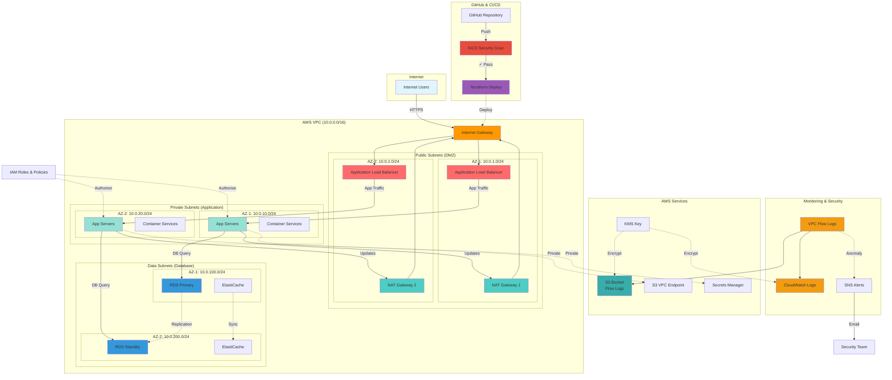

# VPC Infrastructure Architecture Diagram

## 🖼️ Visual Architecture

### Full Architecture Diagram (PNG)

The detailed architecture diagram has been generated as `vpc_architecture_diagram.png`.

To view it:
```bash
open vpc_architecture_diagram.png
```

---

## 🎨 Interactive Mermaid Diagram

This diagram can be rendered in GitHub, GitLab, and many markdown viewers.



---

## 📋 Component Descriptions

### 1. Internet Layer
- **Users**: External internet users accessing your application
- **Internet Gateway**: Single point of entry/exit for VPC

### 2. CI/CD Pipeline
- **GitHub**: Source code repository
- **KICS Scan**: Security scanning on pull requests
- **Terraform**: Infrastructure deployment automation

### 3. Public Tier (DMZ)
- **Application Load Balancer**: Distributes incoming traffic
- **NAT Gateways**: Enables outbound internet access for private resources
- **High Availability**: Deployed across 2 availability zones

### 4. Private Tier (Application)
- **App Servers**: EC2 instances running application logic
- **Container Services**: ECS/EKS for containerized workloads
- **Isolated**: No direct internet access (via NAT only)

### 5. Data Tier (Database)
- **RDS Primary/Standby**: PostgreSQL databases with automatic failover
- **ElastiCache**: Redis/Memcached for caching
- **Maximum Security**: Completely isolated from internet

### 6. AWS Services
- **S3**: Flow logs storage with lifecycle policies
- **VPC Endpoints**: Private connectivity to AWS services
- **Secrets Manager**: Secure credential storage
- **KMS**: Encryption key management

### 7. Monitoring & Security
- **CloudWatch Logs**: Centralized logging
- **VPC Flow Logs**: Network traffic monitoring
- **SNS**: Alert notifications
- **Security Team**: Email notifications for incidents

---

## 🔄 Traffic Flows

### Inbound User Request
```
Internet User → IGW → ALB → App Server → Database → Response
```

### Outbound Application Request
```
App Server → NAT Gateway → IGW → Internet (Updates/APIs)
```

### AWS Service Access (Private)
```
App Server → VPC Endpoint → AWS Service (S3, Secrets Manager)
```

### Database Replication
```
RDS Primary (AZ-1) ↔ RDS Standby (AZ-2) - Synchronous Replication
```

---

## 🔐 Security Layers

| Layer | Component | Function |
|-------|-----------|----------|
| **1. Perimeter** | Internet Gateway | Controls entry/exit |
| **2. Network** | NACLs | Subnet-level firewall |
| **3. Instance** | Security Groups | Instance-level firewall |
| **4. Identity** | IAM Roles | Permission management |
| **5. Encryption** | KMS | Data encryption at rest |
| **6. Monitoring** | Flow Logs | Traffic visibility |

---

## 📊 High Availability Features

- ✅ **Multi-AZ Deployment**: Resources in 2 availability zones
- ✅ **Redundant NAT Gateways**: One per AZ for fault tolerance
- ✅ **Load Balancing**: Traffic distributed across zones
- ✅ **Database Replication**: Automatic RDS failover
- ✅ **Auto Scaling**: Dynamic capacity adjustment

---

## 🚀 Regenerating the Diagram

### Option 1: PNG Diagram (Python)
```bash
# Activate virtual environment
source venv_diagrams/bin/activate

# Generate diagram
python3 generate_architecture_diagram.py

# Deactivate
deactivate
```

### Option 2: One Command
```bash
./setup_and_generate_diagram.sh
```

### Option 3: Modify and Regenerate
1. Edit `generate_architecture_diagram.py`
2. Add/remove components
3. Run the script again

---

## 📝 Customization Tips

### Add More Services
```python
# In generate_architecture_diagram.py
from diagrams.aws.analytics import Kinesis
from diagrams.aws.ml import Sagemaker

# Add to diagram
kinesis = Kinesis("Data Stream")
ml = Sagemaker("ML Model")
```

### Change Colors/Styles
```python
# Modify edges
app1 >> Edge(color="red", style="bold", label="Critical Path") >> db_primary
```

### Adjust Layout
```python
# Change direction: TB (top-bottom), LR (left-right), BT, RL
direction="LR"
```

---

## 🔗 Related Files

- **[ARCHITECTURE.md](ARCHITECTURE.md)** - Detailed technical documentation
- **[QUICKSTART-ARCHITECTURE.md](QUICKSTART-ARCHITECTURE.md)** - Beginner-friendly guide
- **[README.md](README.md)** - Project overview
- **[vpc_architecture_diagram.png](vpc_architecture_diagram.png)** - Generated diagram

---

## 💡 Pro Tips

1. **Embed in Documentation**: Copy the Mermaid diagram into your README or wiki
2. **Version Control**: Commit the PNG diagram to track architecture changes
3. **Presentations**: Use the PNG for stakeholder presentations
4. **Living Diagram**: Update the Python script as architecture evolves
5. **Export Formats**: The diagrams library supports PNG, SVG, PDF

---

## 🎯 Use Cases

| Audience | Best Format | Why |
|----------|------------|-----|
| **Developers** | Mermaid | Interactive, embedded in docs |
| **Executives** | PNG | High-quality, presentation-ready |
| **Security Team** | Both | Traffic flows + detailed components |
| **New Team Members** | PNG + Quickstart | Visual + explanations |
| **Documentation** | Mermaid | Always up-to-date in markdown |

---

**Generated by AWS Diagrams Library**
*Architecture updated: 2026-02-07*
