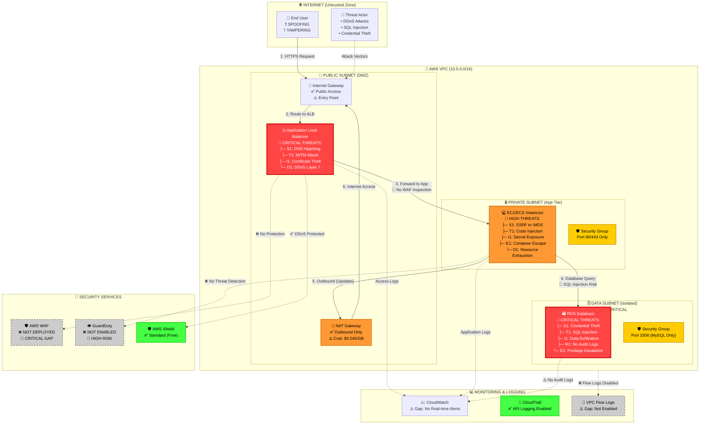
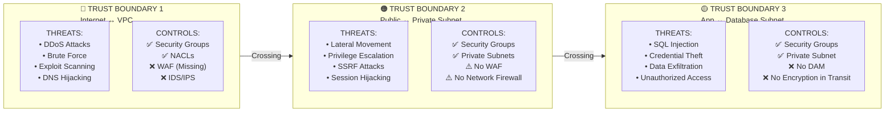
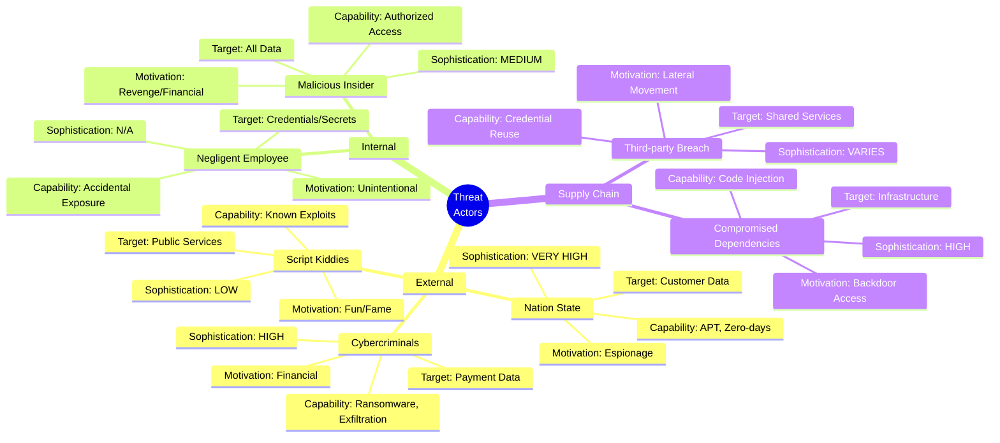

# Visual Architecture with Threat Overlay

## System Architecture with Security Threats



## Trust Boundary Map



## Risk Heat Map by Component

```
┌─────────────────────────────────────────────────────────────────┐
│                    LIKELIHOOD vs IMPACT MATRIX                  │
├─────────────────────────────────────────────────────────────────┤
│                                                                 │
│  IMPACT                                                         │
│    ▲                                                            │
│    │                                                            │
│ C  │         RDS-I1 🔴         ALB-D1 🔴                        │
│ R  │       (Data Leak)        (DDoS Attack)                    │
│ I  │                                                            │
│ T  │    EC2-E1 🔴         EC2-S1 🔴                            │
│ I  │  (Container         (SSRF to                              │
│ C  │    Escape)           IMDS)                                │
│ A  │                                                            │
│ L  ├─────────────────────────────────────────────────────       │
│    │                                                            │
│    │                   ALB-T1 🟠      RDS-R1 🟠                │
│ H  │                   (MITM)      (No Audit)                  │
│ I  │                                                            │
│ G  │      EC2-I1 🟠                                            │
│ H  │   (Secret Leak)                                           │
│    │                                                            │
│    ├─────────────────────────────────────────────────────       │
│    │                                                            │
│ M  │                         NAT-D1 🟡                         │
│ E  │                        (Outage)                           │
│ D  │                                                            │
│    │         SG-T1 🟡                                          │
│    │      (Misconfig)                                          │
│    │                                                            │
│    ├─────────────────────────────────────────────────────       │
│    │                                                            │
│ L  │                                  IGW-S1 🟢                │
│ O  │                                (IP Spoof)                 │
│ W  │                                                            │
│    │                                                            │
│    └─────────────────────────────────────────────────────►     │
│         LOW      MEDIUM      HIGH      VERY HIGH               │
│                      LIKELIHOOD                                │
└─────────────────────────────────────────────────────────────────┘

Legend: 🔴 Critical  🟠 High  🟡 Medium  🟢 Low
```

## Attack Surface Visualization

```
                    ┌─────────────────────────┐
                    │   EXTERNAL ATTACKERS    │
                    │   • Nation States       │
                    │   • Cybercriminals      │
                    │   • Script Kiddies      │
                    └───────────┬─────────────┘
                                │
        ┌───────────────────────┼───────────────────────┐
        │                       │                       │
        ▼                       ▼                       ▼
┌───────────────┐      ┌────────────────┐     ┌────────────────┐
│  ATTACK       │      │   ATTACK       │     │   ATTACK       │
│  VECTOR 1:    │      │   VECTOR 2:    │     │   VECTOR 3:    │
│  Web App      │      │   API          │     │   CI/CD        │
│  🔴 CRITICAL  │      │   🟠 HIGH      │     │   🟠 HIGH      │
└───────┬───────┘      └────────┬───────┘     └────────┬───────┘
        │                       │                       │
        └───────────────────────┼───────────────────────┘
                                │
                                ▼
                    ┌───────────────────────┐
                    │  TARGET ASSETS        │
                    │  ├─ Customer PII      │
                    │  ├─ Payment Data      │
                    │  ├─ Business Data     │
                    │  └─ Infrastructure    │
                    └───────────────────────┘

ATTACK SURFACE SCORE: 78/100 (HIGH RISK)
├─ Public Endpoints: 3 (High)
├─ Authentication Points: 2 (Medium)
├─ Data Stores: 1 (Critical)
└─ Third-party Integrations: 0 (Low)
```

## Component Risk Scores

```
┌──────────────────────────────────────────────────────────────┐
│                     COMPONENT RISK SCORING                   │
├──────────────────────────────────────────────────────────────┤
│                                                              │
│  ALB (Load Balancer)              ████████████░░  85/100    │
│  ├─ Exposure: Public              🔴 Critical               │
│  ├─ Controls: Partial             🟠 Insufficient           │
│  └─ Vulnerabilities: 8            🔴 High Count             │
│                                                              │
│  EC2/ECS (Application)            ███████████░░░  78/100    │
│  ├─ Exposure: Private             🟢 Good                   │
│  ├─ Controls: Moderate            🟡 Acceptable             │
│  └─ Vulnerabilities: 6            🟠 Medium Count           │
│                                                              │
│  RDS (Database)                   █████████████  92/100     │
│  ├─ Exposure: Isolated            🟢 Good                   │
│  ├─ Controls: Weak                🔴 Critical Gap           │
│  └─ Vulnerabilities: 10           🔴 Critical Count         │
│                                                              │
│  NAT Gateway                      ████░░░░░░░░░  35/100     │
│  ├─ Exposure: Public              🟠 Medium                 │
│  ├─ Controls: Good                🟢 Strong                 │
│  └─ Vulnerabilities: 2            🟢 Low Count              │
│                                                              │
│  Security Groups                  ██████░░░░░░░  48/100     │
│  ├─ Exposure: N/A                 ➖ Control Layer          │
│  ├─ Controls: Moderate            🟡 Acceptable             │
│  └─ Misconfigurations: 4          🟡 Medium Risk            │
│                                                              │
└──────────────────────────────────────────────────────────────┘

Risk Calculation: (Exposure × 0.4) + (Control Gap × 0.4) + (Vuln Count × 0.2)
```

## Threat Actor Profiles



---

**Document Classification:** CONFIDENTIAL
**Version:** 2.0 (Visual Edition)
**Last Updated:** February 14, 2026
**Tool:** IriusRisk-style Visual Threat Model
