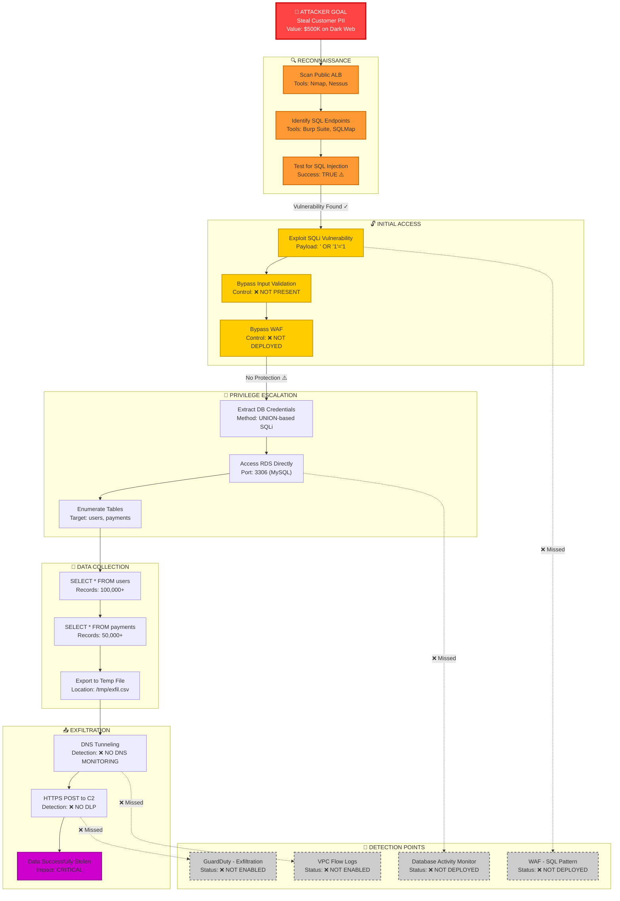
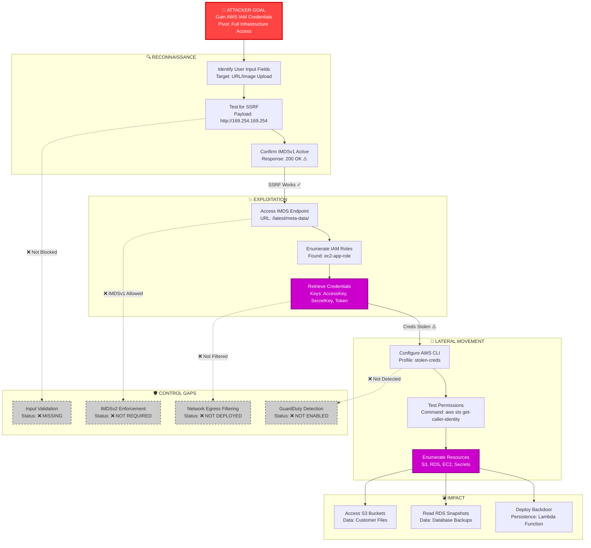
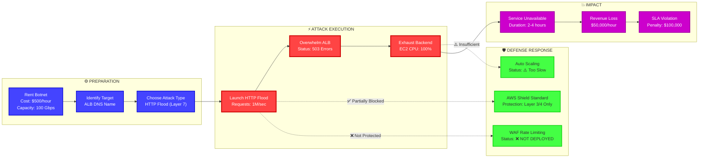
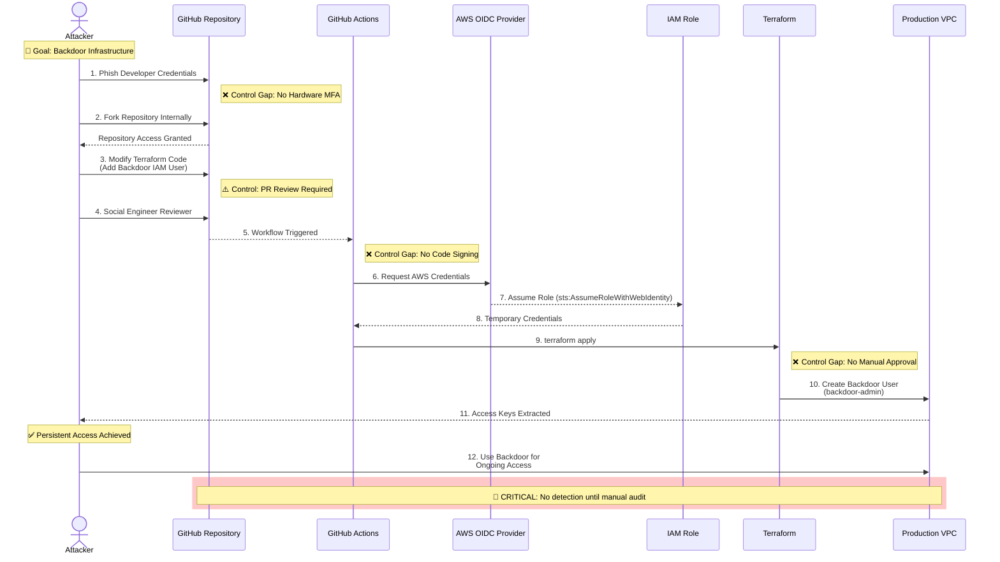

# Attack Path Visualization

## Attack Path 1: Data Exfiltration via SQL Injection



**Attack Complexity:** MEDIUM
**Time to Compromise:** 2-4 hours
**Skill Required:** Intermediate (Automated tools available)
**Detection Probability:** 15% (Very Low)
**Financial Impact:** $500,000 - $2,000,000

---

## Attack Path 2: SSRF to IMDS Credential Theft



**Attack Complexity:** MEDIUM
**Time to Compromise:** 1-2 hours
**Skill Required:** Intermediate
**Detection Probability:** 20% (Low)
**Financial Impact:** $1,000,000+ (Full AWS Compromise)

---

## Attack Path 3: DDoS Against Application Load Balancer



**Attack Complexity:** LOW (Botnet-as-a-Service)
**Time to Impact:** 15-30 minutes
**Skill Required:** Low (Script Kiddie)
**Detection Probability:** 95% (High - Obvious)
**Financial Impact:** $200,000 - $500,000

---

## Attack Path 4: Supply Chain Attack via CI/CD



**Attack Timeline:**
```
Hour 0-24:   Phishing campaign, credential theft
Hour 24-48:  Reconnaissance, code exploration
Hour 48-72:  Malicious code crafted
Hour 72-96:  Social engineering for PR approval
Hour 96:     Backdoor deployed to production
Hour 96+:    Persistent unauthorized access

Detection Probability: 30% (Low-Medium)
Mean Time to Detect: 45 days
```

---

## Attack Kill Chain Visualization

```
┌────────────────────────────────────────────────────────────────────┐
│              LOCKHEED MARTIN CYBER KILL CHAIN                      │
│                  Applied to AWS VPC Infrastructure                 │
├────────────────────────────────────────────────────────────────────┤
│                                                                    │
│  1. RECONNAISSANCE                  🔴 High Risk                  │
│     ├─ Public ALB Enumeration       ✅ CloudFront could hide      │
│     ├─ DNS Enumeration              ✅ Private hosted zone        │
│     └─ Port Scanning                ❌ No IDS/IPS                 │
│                                                                    │
│  2. WEAPONIZATION                   🟠 Medium Risk                │
│     ├─ SQLi Payload Crafting        ⚠️ Automated tools exist      │
│     ├─ SSRF Exploit Development     ⚠️ POC publicly available     │
│     └─ Malware Development          ✅ Antivirus present          │
│                                                                    │
│  3. DELIVERY                        🔴 High Risk                  │
│     ├─ HTTP POST to Web App         ❌ No WAF                     │
│     ├─ Phishing Email               ⚠️ Some email filtering       │
│     └─ Supply Chain (npm)           ❌ No SCA scanning            │
│                                                                    │
│  4. EXPLOITATION                    🔴 Critical Risk              │
│     ├─ SQLi Execution               ❌ No input validation        │
│     ├─ SSRF to IMDS                 ❌ IMDSv1 enabled             │
│     └─ Container Escape             ⚠️ Non-root containers        │
│                                                                    │
│  5. INSTALLATION                    🟠 Medium Risk                │
│     ├─ Backdoor User Creation       ⚠️ CloudTrail logging         │
│     ├─ Persistence Lambda           ⚠️ Some IAM restrictions      │
│     └─ Cryptominer Deployment       ❌ No runtime monitoring      │
│                                                                    │
│  6. COMMAND & CONTROL               🟠 Medium Risk                │
│     ├─ DNS Tunneling                ❌ No DNS monitoring          │
│     ├─ HTTPS C2 Channel             ❌ No SSL inspection          │
│     └─ Tor Exit Node                ❌ No network monitoring      │
│                                                                    │
│  7. ACTIONS ON OBJECTIVES           🔴 Critical Risk              │
│     ├─ Data Exfiltration            ❌ No DLP                     │
│     ├─ Ransomware Deployment        ⚠️ Backups exist             │
│     └─ Service Destruction          ⚠️ CloudTrail alerts          │
│                                                                    │
└────────────────────────────────────────────────────────────────────┘

OVERALL KILL CHAIN RESISTANCE: 35/100 (HIGH VULNERABILITY)

Defense in Depth Score:
├─ Network Layer:     45/100 (Insufficient)
├─ Application Layer: 25/100 (Critical Gaps)
├─ Data Layer:        40/100 (Major Gaps)
└─ Detection Layer:   20/100 (Minimal Coverage)
```

## Threat Progression Timeline

```mermaid
gantt
    title Attack Progression Over Time (Typical SQL Injection Attack)
    dateFormat HH:mm
    axisFormat %H:%M

    section Reconnaissance
    Port Scanning           :recon1, 00:00, 30m
    Service Enumeration     :recon2, after recon1, 45m
    Vulnerability Scanning  :recon3, after recon2, 60m

    section Exploitation
    SQLi Testing           :exploit1, after recon3, 30m
    Bypass Attempts        :exploit2, after exploit1, 45m
    Successful Injection   :crit, exploit3, after exploit2, 15m

    section Privilege Escalation
    DB Enumeration         :priv1, after exploit3, 20m
    Extract Credentials    :priv2, after priv1, 15m
    Escalate Privileges    :crit, priv3, after priv2, 10m

    section Data Exfiltration
    Locate Sensitive Data  :exfil1, after priv3, 30m
    Stage Data             :exfil2, after exfil1, 20m
    Exfiltrate Data        :crit, exfil3, after exfil2, 45m

    section Covering Tracks
    Delete Logs            :cover1, after exfil3, 15m
    Remove Evidence        :cover2, after cover1, 10m
```



**Total Time to Compromise: 4-6 hours**
**Detection Windows:**
- ✅ Reconnaissance Phase: 60% detection probability (if IDS deployed)
- ⚠️ Exploitation Phase: 25% detection probability (if WAF deployed)
- ❌ Exfiltration Phase: 10% detection probability (minimal monitoring)

---

**Document Classification:** CONFIDENTIAL
**Version:** 2.0 (Visual Edition)
**Last Updated:** February 14, 2026
**Tool:** IriusRisk-style Attack Path Analysis
