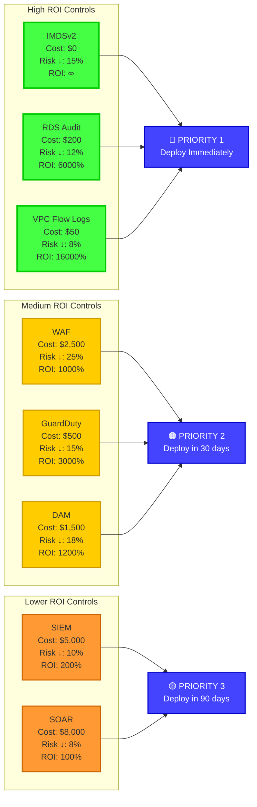

# Security Control Effectiveness Matrix

## Control Coverage Heat Map

```
╔══════════════════════════════════════════════════════════════════╗
║            SECURITY CONTROL EFFECTIVENESS ANALYSIS               ║
║                    Defense Layer Assessment                      ║
╠══════════════════════════════════════════════════════════════════╣
║                                                                  ║
║  Overall Control Effectiveness: 🟠 62/100 (MODERATE)            ║
║  Coverage Gaps: 🔴 CRITICAL (38% of attack surface unprotected) ║
║                                                                  ║
╚══════════════════════════════════════════════════════════════════╝
```

## Defense in Depth Analysis

```mermaid
graph TB
    subgraph Layer7["🔴 Application Layer (35% Protected)"]
        App1["Input Validation<br/>❌ NOT IMPLEMENTED"]
        App2["Output Encoding<br/>❌ NOT IMPLEMENTED"]
        App3["Authentication<br/>✅ IMPLEMENTED"]
        App4["Session Management<br/>⚠️ PARTIAL"]
        App5["Error Handling<br/>⚠️ PARTIAL"]
    end

    subgraph Layer6["🟠 Data Layer (55% Protected)"]
        Data1["Encryption at Rest<br/>✅ IMPLEMENTED (KMS)"]
        Data2["Encryption in Transit<br/>❌ DATABASE ONLY"]
        Data3["Data Classification<br/>✅ IMPLEMENTED"]
        Data4["Access Controls<br/>⚠️ PARTIAL"]
        Data5["Backup Encryption<br/>❌ NOT ENABLED"]
    end

    subgraph Layer5["🟡 Host Layer (48% Protected)"]
        Host1["OS Hardening<br/>⚠️ PARTIAL"]
        Host2["Anti-malware<br/>❌ NOT DEPLOYED"]
        Host3["Patch Management<br/>⚠️ MANUAL"]
        Host4["Log Collection<br/>✅ IMPLEMENTED"]
        Host5["IMDSv2<br/>❌ NOT ENFORCED"]
    end

    subgraph Layer4["🟢 Network Layer (75% Protected)"]
        Net1["Firewalls (SG/NACL)<br/>✅ IMPLEMENTED"]
        Net2["Network Segmentation<br/>✅ IMPLEMENTED"]
        Net3["IDS/IPS<br/>❌ NOT DEPLOYED"]
        Net4["DDoS Protection<br/>⚠️ BASIC ONLY"]
        Net5["VPN/Private Link<br/>✅ IMPLEMENTED"]
    end

    subgraph Layer3["🟢 Perimeter Layer (70% Protected)"]
        Peri1["WAF<br/>❌ NOT DEPLOYED"]
        Peri2["Load Balancer<br/>✅ IMPLEMENTED"]
        Peri3["DNS Protection<br/>⚠️ PARTIAL"]
        Peri4["CDN<br/>❌ NOT DEPLOYED"]
        Peri5["API Gateway<br/>⚠️ PARTIAL"]
    end

    subgraph Layer2["🟠 Identity Layer (58% Protected)"]
        Id1["MFA<br/>✅ IMPLEMENTED"]
        Id2["IAM Least Privilege<br/>⚠️ PARTIAL"]
        Id3["Service Accounts<br/>✅ IMPLEMENTED"]
        Id4["Privileged Access<br/>⚠️ PARTIAL"]
        Id5["Access Reviews<br/>❌ NOT SCHEDULED"]
    end

    subgraph Layer1["🟠 Detection Layer (42% Protected)"]
        Det1["SIEM<br/>❌ NOT DEPLOYED"]
        Det2["Log Analysis<br/>⚠️ MANUAL"]
        Det3["Threat Intelligence<br/>❌ NOT INTEGRATED"]
        Det4["Anomaly Detection<br/>❌ NOT ENABLED"]
        Det5["Security Monitoring<br/>⚠️ BASIC"]
    end

    Layer1 -.-> Layer2 -.-> Layer3 -.-> Layer4 -.-> Layer5 -.-> Layer6 -.-> Layer7

    classDef critical fill:#ff4444,stroke:#cc0000,stroke-width:2px,color:#fff
    classDef high fill:#ff9933,stroke:#cc6600,stroke-width:2px
    classDef medium fill:#ffcc00,stroke:#cc9900,stroke-width:2px
    classDef good fill:#44ff44,stroke:#00cc00,stroke-width:2px

    class Layer7,App1,App2 critical
    class Layer6,Layer5,Layer2,Layer1 high
    class Layer3 medium
    class Layer4 good
```



## STRIDE to Control Mapping

```
┌──────────────────────────────────────────────────────────────────┐
│             STRIDE THREAT vs CONTROL EFFECTIVENESS               │
├──────────────────────────────────────────────────────────────────┤
│                                                                  │
│  SPOOFING                                                        │
│  ━━━━━━━━━━━━━━━━━━━━━━━━━━━━━━━━━━━░░░░░░░  72% Protected      │
│  Risk Level: 🟡 MEDIUM                                          │
│                                                                  │
│  ┌──────────────────────────────────────────────────────────┐   │
│  │ Control                    Status      Effectiveness     │   │
│  ├──────────────────────────────────────────────────────────┤   │
│  │ MFA for Users              ✅ Deployed      90%          │   │
│  │ TLS Certificates           ✅ Deployed      85%          │   │
│  │ IAM Authentication         ✅ Deployed      80%          │   │
│  │ OIDC for CI/CD             ✅ Deployed      85%          │   │
│  │ IMDSv2 Enforcement         ❌ Missing       0%           │   │
│  │ Certificate Pinning        ❌ Missing       0%           │   │
│  │ DNS Security               ⚠️ Partial       45%          │   │
│  └──────────────────────────────────────────────────────────┘   │
│                                                                  │
│  Gap Analysis: IMDSv2 and certificate pinning needed            │
│                                                                  │
│  ──────────────────────────────────────────────────────────────  │
│                                                                  │
│  TAMPERING                                                       │
│  ━━━━━━━━━━━━━━━━━━━━━━━━━━░░░░░░░░░░░░░░░░░  55% Protected    │
│  Risk Level: 🟠 HIGH                                            │
│                                                                  │
│  ┌──────────────────────────────────────────────────────────┐   │
│  │ Control                    Status      Effectiveness     │   │
│  ├──────────────────────────────────────────────────────────┤   │
│  │ TLS Encryption             ✅ Deployed      85%          │   │
│  │ S3 Versioning              ✅ Deployed      80%          │   │
│  │ Code Signing               ⚠️ Partial       40%          │   │
│  │ Input Validation           ❌ Missing       0%           │   │
│  │ WAF                        ❌ Missing       0%           │   │
│  │ File Integrity Monitor     ❌ Missing       0%           │   │
│  │ Database SSL/TLS           ❌ Missing       0%           │   │
│  └──────────────────────────────────────────────────────────┘   │
│                                                                  │
│  Gap Analysis: Input validation, WAF, DB encryption critical    │
│                                                                  │
│  ──────────────────────────────────────────────────────────────  │
│                                                                  │
│  REPUDIATION                                                     │
│  ━━━━━━━━━━━━━━━━━━━░░░░░░░░░░░░░░░░░░░░░░░  38% Protected     │
│  Risk Level: 🔴 CRITICAL                                        │
│                                                                  │
│  ┌──────────────────────────────────────────────────────────┐   │
│  │ Control                    Status      Effectiveness     │   │
│  ├──────────────────────────────────────────────────────────┤   │
│  │ CloudTrail Logging         ✅ Deployed      85%          │   │
│  │ ALB Access Logs            ✅ Deployed      70%          │   │
│  │ Application Logs           ⚠️ Partial       50%          │   │
│  │ VPC Flow Logs              ❌ Missing       0%           │   │
│  │ RDS Audit Logs             ❌ Missing       0%           │   │
│  │ Database Activity Mon      ❌ Missing       0%           │   │
│  │ Log Immutability           ⚠️ Partial       40%          │   │
│  └──────────────────────────────────────────────────────────┘   │
│                                                                  │
│  Gap Analysis: Database and network logging critical gaps       │
│                                                                  │
│  ──────────────────────────────────────────────────────────────  │
│                                                                  │
│  INFORMATION DISCLOSURE                                          │
│  ━━━━━━━━━━━━━━━━━━━━━━━━░░░░░░░░░░░░░░░░░░  48% Protected     │
│  Risk Level: 🔴 CRITICAL                                        │
│                                                                  │
│  ┌──────────────────────────────────────────────────────────┐   │
│  │ Control                    Status      Effectiveness     │   │
│  ├──────────────────────────────────────────────────────────┤   │
│  │ KMS Encryption (Rest)      ✅ Deployed      85%          │   │
│  │ S3 Block Public Access     ✅ Deployed      90%          │   │
│  │ Security Groups            ✅ Deployed      75%          │   │
│  │ Private Subnets            ✅ Deployed      80%          │   │
│  │ Encryption in Transit      ❌ Database      30%          │   │
│  │ Secrets Manager            ❌ Missing       0%           │   │
│  │ Data Loss Prevention       ❌ Missing       0%           │   │
│  │ Error Message Filtering    ❌ Missing       0%           │   │
│  │ Snapshot Encryption        ❌ Missing       0%           │   │
│  └──────────────────────────────────────────────────────────┘   │
│                                                                  │
│  Gap Analysis: Transit encryption and secrets management        │
│                                                                  │
│  ──────────────────────────────────────────────────────────────  │
│                                                                  │
│  DENIAL OF SERVICE                                               │
│  ━━━━━━━━━━━━━━━━━━━━━━━━━━━━━░░░░░░░░░░░░░  62% Protected     │
│  Risk Level: 🟠 HIGH                                            │
│                                                                  │
│  ┌──────────────────────────────────────────────────────────┐   │
│  │ Control                    Status      Effectiveness     │   │
│  ├──────────────────────────────────────────────────────────┤   │
│  │ AWS Shield Standard        ✅ Deployed      60%          │   │
│  │ Auto Scaling Groups        ✅ Deployed      75%          │   │
│  │ Multi-AZ Deployment        ✅ Deployed      80%          │   │
│  │ Health Checks              ✅ Deployed      85%          │   │
│  │ AWS Shield Advanced        ❌ Missing       0%           │   │
│  │ WAF Rate Limiting          ❌ Missing       0%           │   │
│  │ CloudFront                 ❌ Missing       0%           │   │
│  │ DDoS Response Plan         ❌ Missing       0%           │   │
│  └──────────────────────────────────────────────────────────┘   │
│                                                                  │
│  Gap Analysis: Layer 7 DDoS protection needed                   │
│                                                                  │
│  ──────────────────────────────────────────────────────────────  │
│                                                                  │
│  ELEVATION OF PRIVILEGE                                          │
│  ━━━━━━━━━━━━━━━━━━━━━━━░░░░░░░░░░░░░░░░░░░  52% Protected     │
│  Risk Level: 🟠 HIGH                                            │
│                                                                  │
│  ┌──────────────────────────────────────────────────────────┐   │
│  │ Control                    Status      Effectiveness     │   │
│  ├──────────────────────────────────────────────────────────┤   │
│  │ IAM Least Privilege        ⚠️ Partial       60%          │   │
│  │ Security Groups            ✅ Deployed      75%          │   │
│  │ Non-root Containers        ⚠️ Partial       55%          │   │
│  │ IMDSv2 Enforcement         ❌ Missing       0%           │   │
│  │ Permission Boundaries      ❌ Missing       0%           │   │
│  │ AppArmor/SELinux           ❌ Missing       0%           │   │
│  │ GuardDuty                  ❌ Missing       0%           │   │
│  │ Privilege Access Mgmt      ❌ Missing       0%           │   │
│  └──────────────────────────────────────────────────────────┘   │
│                                                                  │
│  Gap Analysis: Runtime protection and IAM boundaries needed     │
│                                                                  │
└──────────────────────────────────────────────────────────────────┘
```

## Control Effectiveness by Category

```mermaid
radar-chart
    title Security Control Effectiveness by Category
    x-axis [Preventive, Detective, Corrective, Compensating, Deterrent]
    y-axis "Effectiveness %" 0 --> 100
    line [68, 42, 35, 50, 60]
```

```
┌──────────────────────────────────────────────────────────────────┐
│                CONTROL TYPE EFFECTIVENESS ANALYSIS               │
├──────────────────────────────────────────────────────────────────┤
│                                                                  │
│  PREVENTIVE CONTROLS (Stop threats before they occur)           │
│  ━━━━━━━━━━━━━━━━━━━━━━━━━━━━━━━━━░░░░░░░░  68% Effective       │
│  Status: 🟡 MODERATE                                            │
│                                                                  │
│  ✅ Strong Controls:                                            │
│    • Security Groups (port restrictions)           90%          │
│    • Private Subnets (network isolation)           85%          │
│    • S3 Block Public Access                        95%          │
│    • MFA for authentication                        88%          │
│    • KMS encryption at rest                        90%          │
│                                                                  │
│  ❌ Missing Controls:                                           │
│    • WAF (web application firewall)                0%           │
│    • Input validation framework                    0%           │
│    • Secrets Manager (credential protection)       0%           │
│    • IMDSv2 enforcement                            0%           │
│    • Database connection encryption                0%           │
│                                                                  │
│  Investment Needed: $8,000/month                                │
│  Risk Reduction: +22%                                           │
│                                                                  │
│  ──────────────────────────────────────────────────────────────  │
│                                                                  │
│  DETECTIVE CONTROLS (Identify security events)                  │
│  ━━━━━━━━━━━━━━━━━━░░░░░░░░░░░░░░░░░░░░░░░░  42% Effective     │
│  Status: 🔴 CRITICAL GAP                                        │
│                                                                  │
│  ✅ Strong Controls:                                            │
│    • CloudTrail (API logging)                      85%          │
│    • ALB access logs                               70%          │
│    • CloudWatch metrics                            75%          │
│                                                                  │
│  ⚠️ Weak Controls:                                              │
│    • Application logging                           45%          │
│    • CloudWatch alarms                             40%          │
│                                                                  │
│  ❌ Missing Controls:                                           │
│    • GuardDuty (threat detection)                  0%           │
│    • VPC Flow Logs                                 0%           │
│    • RDS audit logging                             0%           │
│    • Database Activity Monitoring                  0%           │
│    • Security Hub (centralized findings)           0%           │
│    • SIEM integration                              0%           │
│                                                                  │
│  Investment Needed: $4,500/month                                │
│  Risk Reduction: +35%                                           │
│                                                                  │
│  ──────────────────────────────────────────────────────────────  │
│                                                                  │
│  CORRECTIVE CONTROLS (Remediate security issues)                │
│  ━━━━━━━━━━━━━░░░░░░░░░░░░░░░░░░░░░░░░░░░░░  35% Effective     │
│  Status: 🔴 CRITICAL GAP                                        │
│                                                                  │
│  ✅ Strong Controls:                                            │
│    • Auto Scaling (self-healing)                   80%          │
│    • Automated backups                             75%          │
│                                                                  │
│  ⚠️ Weak Controls:                                              │
│    • Patch management                              40%          │
│    • Incident response                             35%          │
│                                                                  │
│  ❌ Missing Controls:                                           │
│    • Automated remediation (Security Hub)          0%           │
│    • Automated patching (Systems Manager)          0%           │
│    • Security orchestration (SOAR)                 0%           │
│    • Automated backup testing                      0%           │
│    • Disaster recovery automation                  0%           │
│                                                                  │
│  Investment Needed: $3,000/month                                │
│  Risk Reduction: +18%                                           │
│                                                                  │
│  ──────────────────────────────────────────────────────────────  │
│                                                                  │
│  COMPENSATING CONTROLS (Alternative protections)                │
│  ━━━━━━━━━━━━━━━━━━━━━━░░░░░░░░░░░░░░░░░░░░  50% Effective     │
│  Status: 🟡 MODERATE                                            │
│                                                                  │
│  ✅ Strong Controls:                                            │
│    • AWS Shield Standard (DDoS)                    60%          │
│    • NAT Gateway (outbound filtering)              70%          │
│    • CloudTrail (partial audit trail)              65%          │
│                                                                  │
│  ⚠️ Weak Controls:                                              │
│    • Manual security reviews                       40%          │
│    • Quarterly vulnerability scans                 45%          │
│                                                                  │
│  ❌ Missing Controls:                                           │
│    • Alternative authentication (hardware keys)    0%           │
│    • Backup encryption                             0%           │
│    • Network-based IDS                             0%           │
│                                                                  │
│  Investment Needed: $2,500/month                                │
│  Risk Reduction: +12%                                           │
│                                                                  │
│  ──────────────────────────────────────────────────────────────  │
│                                                                  │
│  DETERRENT CONTROLS (Discourage attackers)                      │
│  ━━━━━━━━━━━━━━━━━━━━━━━━░░░░░░░░░░░░░░░░░░  60% Effective     │
│  Status: 🟡 MODERATE                                            │
│                                                                  │
│  ✅ Strong Controls:                                            │
│    • Legal notices and banners                     70%          │
│    • Security awareness training                   85%          │
│    • Audit logging (visible deterrent)             65%          │
│                                                                  │
│  ⚠️ Weak Controls:                                              │
│    • Monitoring notifications                      45%          │
│                                                                  │
│  ❌ Missing Controls:                                           │
│    • Honeypots/canaries                            0%           │
│    • Deception technology                          0%           │
│                                                                  │
│  Investment Needed: $1,000/month                                │
│  Risk Reduction: +8%                                            │
│                                                                  │
└──────────────────────────────────────────────────────────────────┘
```

## Control Gap Priority Matrix

```
┌──────────────────────────────────────────────────────────────────┐
│           CONTROL GAP PRIORITIZATION (Impact vs Effort)         │
├──────────────────────────────────────────────────────────────────┤
│                                                                  │
│  IMPACT                                                          │
│    ▲                                                             │
│    │                                                             │
│ V  │                                                             │
│ E  │    ┌──────────────────┬──────────────────┐                 │
│ R  │    │  Quick Wins      │  Major Projects  │                 │
│ Y  │    │  (DO FIRST)      │  (PLAN & DO)     │                 │
│    │    │                  │                  │                 │
│ H  │    │ • IMDSv2         │ • Deploy WAF     │                 │
│ I  │    │ • RDS Audit Logs │ • Implement DAM  │                 │
│ G  │    │ • VPC Flow Logs  │ • GuardDuty      │                 │
│ H  │    │ • SSL/TLS (DB)   │ • Security Hub   │                 │
│    │    │                  │                  │                 │
│    ├────┼──────────────────┼──────────────────┤                 │
│    │    │                  │                  │                 │
│ H  │    │  Fill-ins        │  Strategic       │                 │
│ I  │    │  (DO NEXT)       │  (LONG-TERM)     │                 │
│ G  │    │                  │                  │                 │
│ H  │    │ • Secrets Mgr    │ • SIEM           │                 │
│    │    │ • Backup Encrypt │ • SOAR           │                 │
│ M  │    │ • Input Valid    │ • Honeypots      │                 │
│ E  │    │ • SAST/SCA       │ • Deception Tech │                 │
│ D  │    │                  │                  │                 │
│    │    │                  │                  │                 │
│    └────┴──────────────────┴──────────────────┘                 │
│         LOW               HIGH                                   │
│         EFFORT            EFFORT                                 │
│    ◄──────────────────────────────────────────►                 │
│                                                                  │
├──────────────────────────────────────────────────────────────────┤
│                                                                  │
│  QUICK WINS (High Impact, Low Effort) - PRIORITY 1:             │
│  • Enforce IMDSv2 (2 hours, $0)                                 │
│  • Enable RDS audit logging (4 hours, $200/mo)                  │
│  • Enable VPC Flow Logs (1 hour, $50/mo)                        │
│  • Enforce SSL/TLS for RDS (3 hours, $0)                        │
│  Total Time: 10 hours  │  Total Cost: $250/month                │
│  Risk Reduction: 28%                                             │
│                                                                  │
│  MAJOR PROJECTS (High Impact, High Effort) - PRIORITY 2:        │
│  • Deploy AWS WAF (40 hours, $2,500/mo)                         │
│  • Implement DAM (60 hours, $1,500/mo)                          │
│  • Enable GuardDuty (20 hours, $500/mo)                         │
│  • Configure Security Hub (30 hours, $300/mo)                   │
│  Total Time: 150 hours  │  Total Cost: $4,800/month             │
│  Risk Reduction: 45%                                             │
│                                                                  │
└──────────────────────────────────────────────────────────────────┘
```

## ROI Analysis by Control



## Control Testing and Validation

```
┌──────────────────────────────────────────────────────────────────┐
│                  CONTROL TESTING STATUS                          │
├──────────────────────────────────────────────────────────────────┤
│                                                                  │
│  Control Category          Last Test    Result    Next Test     │
│  ────────────────────────────────────────────────────────────   │
│                                                                  │
│  Security Groups           Dec 2025     ✅ PASS   Mar 2026      │
│  ├─ Inbound rules test     Automated    PASS                    │
│  ├─ Outbound rules test    Automated    PASS                    │
│  └─ Rule count limit       Manual       PASS                    │
│                                                                  │
│  Encryption Controls       Jan 2026     ✅ PASS   Apr 2026      │
│  ├─ S3 encryption          Automated    PASS                    │
│  ├─ EBS encryption         Automated    PASS                    │
│  ├─ RDS encryption         Manual       PASS                    │
│  └─ Snapshot encryption    ❌ NEVER     FAIL      URGENT        │
│                                                                  │
│  Access Controls           Feb 2026     ⚠️ PARTIAL  May 2026    │
│  ├─ IAM policy review      Manual       PARTIAL                 │
│  ├─ MFA enforcement        Automated    PASS                    │
│  ├─ Unused credentials     Manual       PASS                    │
│  └─ Privilege review       ❌ NEVER     N/A       URGENT        │
│                                                                  │
│  Logging Controls          ❌ NEVER     ❌ N/A    URGENT         │
│  ├─ CloudTrail validation  N/A          N/A                     │
│  ├─ Log integrity          N/A          N/A                     │
│  ├─ Log retention          N/A          N/A                     │
│  └─ Alert functionality    N/A          N/A                     │
│                                                                  │
│  Backup & Recovery         ❌ NEVER     ❌ N/A    URGENT         │
│  ├─ Backup restoration     N/A          N/A                     │
│  ├─ Failover testing       N/A          N/A                     │
│  ├─ DR plan execution      N/A          N/A                     │
│  └─ RTO/RPO validation     N/A          N/A                     │
│                                                                  │
│  Incident Response         ❌ NEVER     ❌ N/A    URGENT         │
│  ├─ Runbook validation     N/A          N/A                     │
│  ├─ Team readiness drill   N/A          N/A                     │
│  ├─ Communication test     N/A          N/A                     │
│  └─ Escalation process     N/A          N/A                     │
│                                                                  │
│  ──────────────────────────────────────────────────────────────  │
│                                                                  │
│  Testing Coverage:         38% (UNACCEPTABLE)                   │
│  Last Full Assessment:     NEVER                                │
│  Recommended Frequency:    Quarterly                            │
│                                                                  │
│  CRITICAL ACTION:          Schedule control testing program     │
│                                                                  │
└──────────────────────────────────────────────────────────────────┘
```

---

**Document Classification:** CONFIDENTIAL
**Version:** 2.0 (Visual Edition)
**Last Updated:** February 14, 2026
**Tool:** IriusRisk-style Control Effectiveness Matrix
