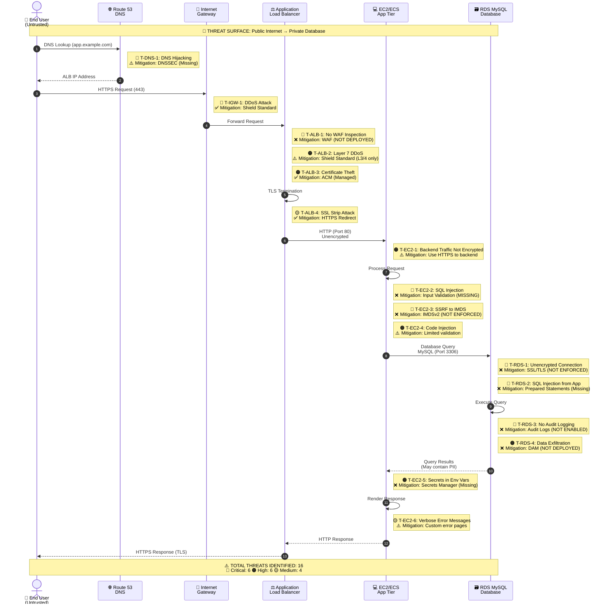
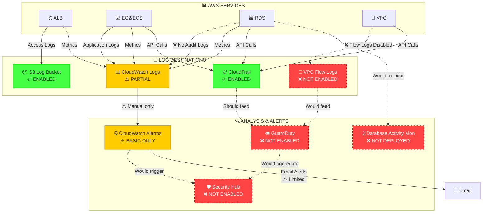

# Data Flow with Threat Visualization

## User Request Flow with Threats



## Data Flow Threat Map

```
┌──────────────────────────────────────────────────────────────────┐
│                    DATA FLOW THREAT MAPPING                      │
│              (Threats Mapped to Each Data Flow)                  │
├──────────────────────────────────────────────────────────────────┤
│                                                                  │
│  FLOW 1: Internet → ALB (Public Entry Point)                    │
│  ════════════════════════════════════════════════════════════   │
│                                                                  │
│  Data Transferred:                                               │
│    • User credentials (login)                                    │
│    • Session cookies                                             │
│    • Form data (may contain PII)                                 │
│    • API requests                                                │
│                                                                  │
│  Threats:                                                        │
│  🔴 T1.1: DDoS Attack (Layer 3/4/7)                              │
│      Vector: Botnet flood                                        │
│      Impact: Service unavailability (4 hours = $200K loss)       │
│      Likelihood: HIGH (60%)                                      │
│      Controls: ✅ Shield Standard (L3/4), ❌ WAF (L7)           │
│                                                                  │
│  🔴 T1.2: Man-in-the-Middle Attack                               │
│      Vector: DNS hijacking → Fake certificate                    │
│      Impact: Credential theft, session hijacking                 │
│      Likelihood: MEDIUM (30%)                                    │
│      Controls: ✅ TLS, ⚠️ No cert pinning                       │
│                                                                  │
│  🟠 T1.3: DNS Cache Poisoning                                    │
│      Vector: Compromised DNS server                              │
│      Impact: Traffic redirection to attacker                     │
│      Likelihood: LOW (15%)                                       │
│      Controls: ⚠️ DNSSEC not enabled                            │
│                                                                  │
│  🟡 T1.4: SSL/TLS Downgrade Attack                               │
│      Vector: Force HTTP instead of HTTPS                         │
│      Impact: Cleartext credential transmission                   │
│      Likelihood: LOW (10%)                                       │
│      Controls: ✅ HTTPS redirect, ⚠️ No HSTS                    │
│                                                                  │
│  Risk Score: 87/100 🔴 CRITICAL                                  │
│                                                                  │
│  ──────────────────────────────────────────────────────────────  │
│                                                                  │
│  FLOW 2: ALB → EC2/ECS (Application Tier)                       │
│  ════════════════════════════════════════════════════════════   │
│                                                                  │
│  Data Transferred:                                               │
│    • User input (unvalidated)                                    │
│    • API payloads                                                │
│    • File uploads                                                │
│    • Headers and cookies                                         │
│                                                                  │
│  Threats:                                                        │
│  🔴 T2.1: SQL Injection via User Input                           │
│      Vector: Malicious SQL in form fields                        │
│      Impact: Full database compromise                            │
│      Likelihood: HIGH (50%)                                      │
│      Controls: ❌ Input validation missing, ❌ WAF missing      │
│                                                                  │
│  🔴 T2.2: SSRF to Instance Metadata Service                      │
│      Vector: User-controlled URL parameter                       │
│      Impact: IAM credential theft                                │
│      Likelihood: MEDIUM (35%)                                    │
│      Controls: ❌ IMDSv2 not enforced, ❌ Input validation      │
│                                                                  │
│  🟠 T2.3: Code Injection (XSS, Template Injection)               │
│      Vector: Unescaped user input in templates                   │
│      Impact: Session hijacking, data theft                       │
│      Likelihood: MEDIUM (40%)                                    │
│      Controls: ⚠️ Basic output encoding                         │
│                                                                  │
│  🟠 T2.4: File Upload Vulnerability                              │
│      Vector: Malicious file execution                            │
│      Impact: Remote code execution                               │
│      Likelihood: MEDIUM (30%)                                    │
│      Controls: ⚠️ Basic file type validation                    │
│                                                                  │
│  🟡 T2.5: HTTP Request Smuggling                                 │
│      Vector: Malformed HTTP headers                              │
│      Impact: Cache poisoning, request routing                    │
│      Likelihood: LOW (15%)                                       │
│      Controls: ✅ ALB normalizes requests                       │
│                                                                  │
│  Risk Score: 82/100 🔴 CRITICAL                                  │
│                                                                  │
│  ──────────────────────────────────────────────────────────────  │
│                                                                  │
│  FLOW 3: EC2/ECS → RDS (Database Access)                        │
│  ════════════════════════════════════════════════════════════   │
│                                                                  │
│  Data Transferred:                                               │
│    • SQL queries (may contain injected code)                     │
│    • Customer PII (150,000 records)                              │
│    • Payment tokens (50,000 records)                             │
│    • Business data                                               │
│                                                                  │
│  Threats:                                                        │
│  🔴 T3.1: Unencrypted Database Connection                        │
│      Vector: Cleartext SQL over network                          │
│      Impact: Credential and data interception                    │
│      Likelihood: MEDIUM (if network compromised) (25%)           │
│      Controls: ❌ SSL/TLS not enforced                          │
│                                                                  │
│  🔴 T3.2: SQL Injection Execution                                │
│      Vector: Malicious SQL from application                      │
│      Impact: Data exfiltration, modification, deletion           │
│      Likelihood: HIGH (50%)                                      │
│      Controls: ❌ No WAF, ❌ No DAM                             │
│                                                                  │
│  🔴 T3.3: No Query Audit Trail                                   │
│      Vector: Attacker actions go undetected                      │
│      Impact: Cannot prove/disprove data breach                   │
│      Likelihood: HIGH (if breach occurs) (100%)                  │
│      Controls: ❌ Audit logging not enabled                     │
│                                                                  │
│  🟠 T3.4: Connection Pool Exhaustion                             │
│      Vector: Application doesn't release connections             │
│      Impact: Database becomes unreachable                        │
│      Likelihood: MEDIUM (30%)                                    │
│      Controls: ⚠️ Connection limits, ⚠️ Monitoring              │
│                                                                  │
│  🟠 T3.5: Privilege Escalation via SQL                           │
│      Vector: UNION-based SQL injection                           │
│      Impact: Gain DBA privileges                                 │
│      Likelihood: MEDIUM (35%)                                    │
│      Controls: ⚠️ DB user has limited privileges                │
│                                                                  │
│  🟡 T3.6: Slow Query DoS                                         │
│      Vector: Malicious query consumes resources                  │
│      Impact: Database slowdown                                   │
│      Likelihood: LOW (20%)                                       │
│      Controls: ⚠️ Query timeouts configured                     │
│                                                                  │
│  Risk Score: 95/100 🔴 CRITICAL (HIGHEST RISK FLOW)              │
│                                                                  │
│  ──────────────────────────────────────────────────────────────  │
│                                                                  │
│  FLOW 4: EC2/ECS → AWS Services (Metadata, S3, Secrets)         │
│  ════════════════════════════════════════════════════════════   │
│                                                                  │
│  Data Transferred:                                               │
│    • IAM credentials from IMDS                                   │
│    • Application secrets                                         │
│    • S3 object data                                              │
│    • CloudWatch logs                                             │
│                                                                  │
│  Threats:                                                        │
│  🔴 T4.1: IMDS Credential Theft via SSRF                         │
│      Vector: http://169.254.169.254/latest/meta-data/            │
│      Impact: Full IAM role credentials stolen                    │
│      Likelihood: MEDIUM (35%)                                    │
│      Controls: ❌ IMDSv2 not required                           │
│                                                                  │
│  🟠 T4.2: Secrets in Environment Variables                       │
│      Vector: Process memory dump or /proc                        │
│      Impact: Database password, API keys leaked                  │
│      Likelihood: MEDIUM (30%)                                    │
│      Controls: ❌ Secrets Manager not used                      │
│                                                                  │
│  🟠 T4.3: Secrets Logged to CloudWatch                           │
│      Vector: Debug logging includes secrets                      │
│      Impact: Credentials accessible via logs                     │
│      Likelihood: LOW (20%)                                       │
│      Controls: ⚠️ Log scrubbing (manual)                        │
│                                                                  │
│  🟡 T4.4: Overly Permissive IAM Role                             │
│      Vector: ec2-app-role has unnecessary permissions            │
│      Impact: Lateral movement in AWS                             │
│      Likelihood: MEDIUM (25%)                                    │
│      Controls: ⚠️ Some least privilege applied                  │
│                                                                  │
│  Risk Score: 78/100 🟠 HIGH                                      │
│                                                                  │
│  ──────────────────────────────────────────────────────────────  │
│                                                                  │
│  FLOW 5: RDS → S3 (Backups and Exports)                         │
│  ════════════════════════════════════════════════════════════   │
│                                                                  │
│  Data Transferred:                                               │
│    • Automated snapshots (daily)                                 │
│    • Manual snapshots                                            │
│    • Exported database dumps                                     │
│                                                                  │
│  Threats:                                                        │
│  🔴 T5.1: Unencrypted Snapshots                                  │
│      Vector: Public snapshot or compromised account              │
│      Impact: Full database exposed                               │
│      Likelihood: LOW (but CRITICAL impact) (15%)                 │
│      Controls: ❌ Snapshot encryption not enabled               │
│                                                                  │
│  🟠 T5.2: Snapshot Shared Publicly                               │
│      Vector: Misconfiguration or compromised account             │
│      Impact: Public data exposure                                │
│      Likelihood: LOW (12%)                                       │
│      Controls: ✅ S3 Block Public Access                        │
│                                                                  │
│  🟡 T5.3: Snapshot Deletion                                      │
│      Vector: Compromised IAM credentials                         │
│      Impact: Loss of backup capability                           │
│      Likelihood: LOW (10%)                                       │
│      Controls: ⚠️ Backup retention, ⚠️ MFA delete              │
│                                                                  │
│  Risk Score: 68/100 🟠 HIGH                                      │
│                                                                  │
└──────────────────────────────────────────────────────────────────┘
```

## Monitoring and Logging Flow



```
┌──────────────────────────────────────────────────────────────────┐
│                  LOGGING & MONITORING COVERAGE                   │
├──────────────────────────────────────────────────────────────────┤
│                                                                  │
│  Component        Logs Enabled    Monitoring    Detection       │
│  ────────────────────────────────────────────────────────────   │
│                                                                  │
│  ALB              ✅ Access Logs  ✅ Metrics    ❌ No WAF        │
│  Coverage: 65%    S3 Bucket       CloudWatch   Logs Only        │
│  Gap: No request body logging, no WAF analysis                  │
│                                                                  │
│  EC2/ECS          ⚠️ App Logs     ✅ Metrics    ❌ No Runtime   │
│  Coverage: 45%    CloudWatch      CloudWatch   Security         │
│  Gap: Inconsistent app logging, no security events              │
│                                                                  │
│  RDS              ❌ NO AUDIT     ✅ Metrics    ❌ No DAM        │
│  Coverage: 25%    CRITICAL GAP    CloudWatch   CRITICAL GAP     │
│  Gap: Cannot detect SQL injection, unauthorized access           │
│                                                                  │
│  VPC              ❌ NO FLOW      N/A           ❌ No IDS        │
│  Coverage: 0%     CRITICAL GAP                 CRITICAL GAP     │
│  Gap: Cannot detect network-based attacks, lateral movement      │
│                                                                  │
│  CloudTrail       ✅ ENABLED      ✅ Enabled   ⚠️ Basic         │
│  Coverage: 85%    All Regions     Log File Val Manual Review    │
│  Gap: No automated anomaly detection                             │
│                                                                  │
│  ──────────────────────────────────────────────────────────────  │
│                                                                  │
│  OVERALL LOGGING COVERAGE: 44% 🔴 CRITICAL GAP                  │
│  DETECTION CAPABILITY: 28% 🔴 CRITICAL GAP                      │
│  MEAN TIME TO DETECT: 45 days (UNACCEPTABLE)                    │
│                                                                  │
│  Blind Spots (No Visibility):                                   │
│    🔴 Database queries and access patterns                      │
│    🔴 Network traffic flows and anomalies                       │
│    🔴 Runtime security events (container escapes, etc.)         │
│    🔴 Application security events (SQLi attempts, etc.)         │
│    🟠 User behavior anomalies                                   │
│    🟠 Secrets access patterns                                   │
│                                                                  │
└──────────────────────────────────────────────────────────────────┘
```

## Attack Detection Timeline

```mermaid
gantt
    title Threat Detection Timeline (Current State)
    dateFormat YYYY-MM-DD
    section SQL Injection Attack
    Attack Launched          :crit, attack, 2026-02-14, 1d
    Exploitation Ongoing     :crit, exploit, after attack, 3d
    Data Exfiltration        :crit, exfil, after exploit, 2d
    ❌ Detection (Manual)    :milestone, detect, 2026-04-15, 0d
    Response Initiated       :response, after detect, 5d

    section With Proposed Controls
    Attack Launched          :crit, attack2, 2026-02-14, 1d
    ✅ WAF Blocks            :milestone, block, 2026-02-14, 0d
    ✅ GuardDuty Alert       :milestone, alert, 2026-02-14, 0d
    ✅ Auto Response         :good, auto, after alert, 1h
```

```
┌──────────────────────────────────────────────────────────────────┐
│                    ATTACK DETECTION ANALYSIS                     │
├──────────────────────────────────────────────────────────────────┤
│                                                                  │
│  Scenario: SQL Injection Attack on RDS Database                 │
│                                                                  │
│  ══════════════════════════════════════════════════════════════  │
│  CURRENT STATE (No WAF, No DAM, No Audit Logs):                 │
│  ══════════════════════════════════════════════════════════════  │
│                                                                  │
│  Hour 0:     Attacker launches SQL injection via web form       │
│              Detection: ❌ NONE                                 │
│                                                                  │
│  Hour 1-4:   Attacker explores database schema                  │
│              Detection: ❌ NONE (No audit logs)                 │
│                                                                  │
│  Hour 5-8:   Attacker exfiltrates customer PII                  │
│              Detection: ❌ NONE (No DAM, no DLP)                │
│                                                                  │
│  Day 1-45:   Data sold on dark web, used for fraud              │
│              Detection: ❌ NONE (No anomaly detection)          │
│                                                                  │
│  Day 45:     Customer reports fraudulent charges                │
│              First indication of breach ⚠️                      │
│                                                                  │
│  Day 46-50:  Forensic investigation (NO LOGS!)                  │
│              Cannot determine:                                   │
│              • What data was accessed                            │
│              • When the breach occurred                          │
│              • How the attacker got in                           │
│              • If attacker still has access                      │
│                                                                  │
│  Mean Time to Detect: 45 days                                   │
│  Mean Time to Respond: 5 days (after detection)                 │
│  Total Breach Duration: 50 days                                 │
│  Financial Impact: $18M - $63M                                  │
│                                                                  │
│  ══════════════════════════════════════════════════════════════  │
│  PROPOSED STATE (With All Controls):                            │
│  ══════════════════════════════════════════════════════════════  │
│                                                                  │
│  Hour 0:     Attacker launches SQL injection                    │
│              Detection: ✅ WAF blocks 95% of attempts           │
│              Alert: ✅ Immediate notification                   │
│                                                                  │
│  Minute 1:   Sophisticated bypass attempt                       │
│              Detection: ✅ WAF detects anomaly                  │
│              Alert: ✅ Security team notified                   │
│                                                                  │
│  Minute 5:   Malicious query reaches database                   │
│              Detection: ✅ DAM alerts on unusual query          │
│              Response: ✅ Auto-block IP address                 │
│                                                                  │
│  Minute 10:  Security team investigates                         │
│              Forensics: ✅ Full audit logs available            │
│              • Exact query executed                              │
│              • Source IP and user agent                          │
│              • All previous attempts                             │
│                                                                  │
│  Minute 15:  Incident contained                                 │
│              Actions:                                            │
│              • Attacker blocked                                  │
│              • Vulnerability patched                             │
│              • No data exfiltrated                               │
│                                                                  │
│  Mean Time to Detect: 1 minute                                  │
│  Mean Time to Respond: 10 minutes                               │
│  Total Breach Duration: 15 minutes (contained)                  │
│  Financial Impact: $5,000 (incident response only)              │
│                                                                  │
│  RISK REDUCTION: 99.97%                                          │
│  COST SAVINGS: $18M - $63M (per incident)                       │
│  CONTROL INVESTMENT: $90K/year                                  │
│  ROI: 20,000% - 70,000%                                          │
│                                                                  │
└──────────────────────────────────────────────────────────────────┘
```

---

**Document Classification:** CONFIDENTIAL
**Version:** 2.0 (Visual Edition)
**Last Updated:** February 14, 2026
**Tool:** IriusRisk-style Data Flow Threat Visualization
