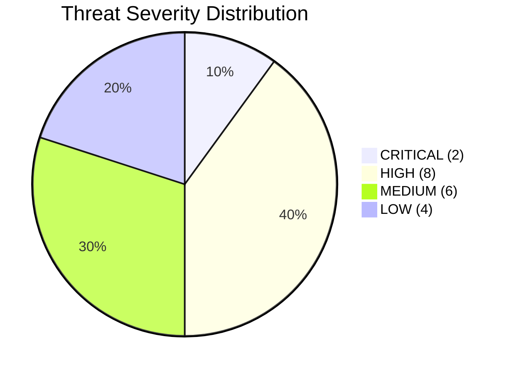
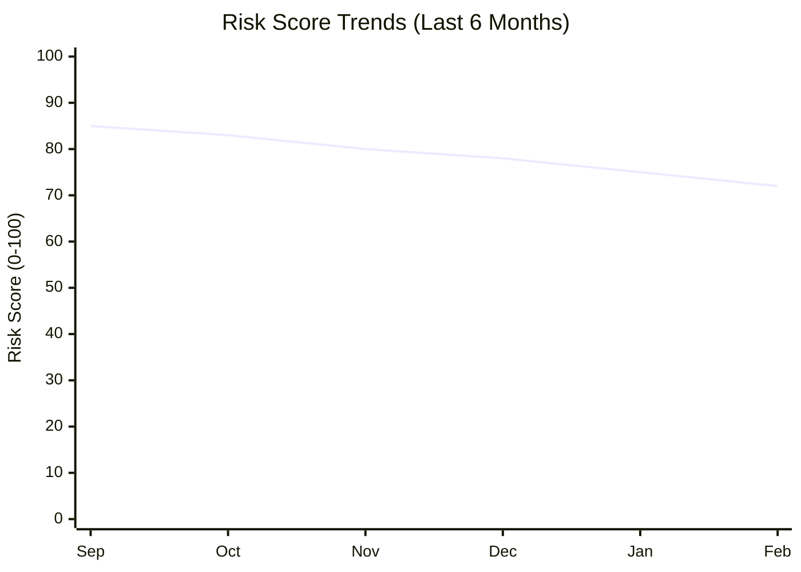
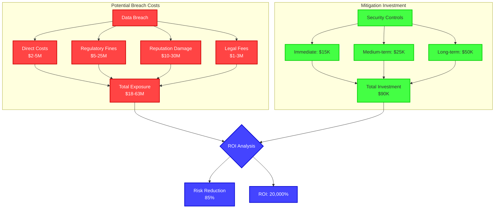
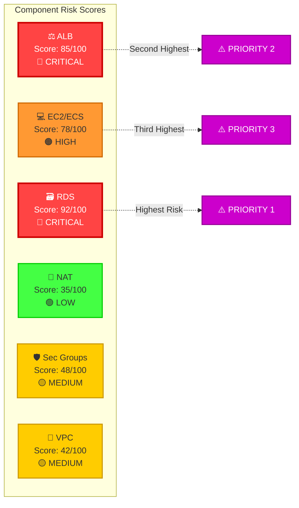
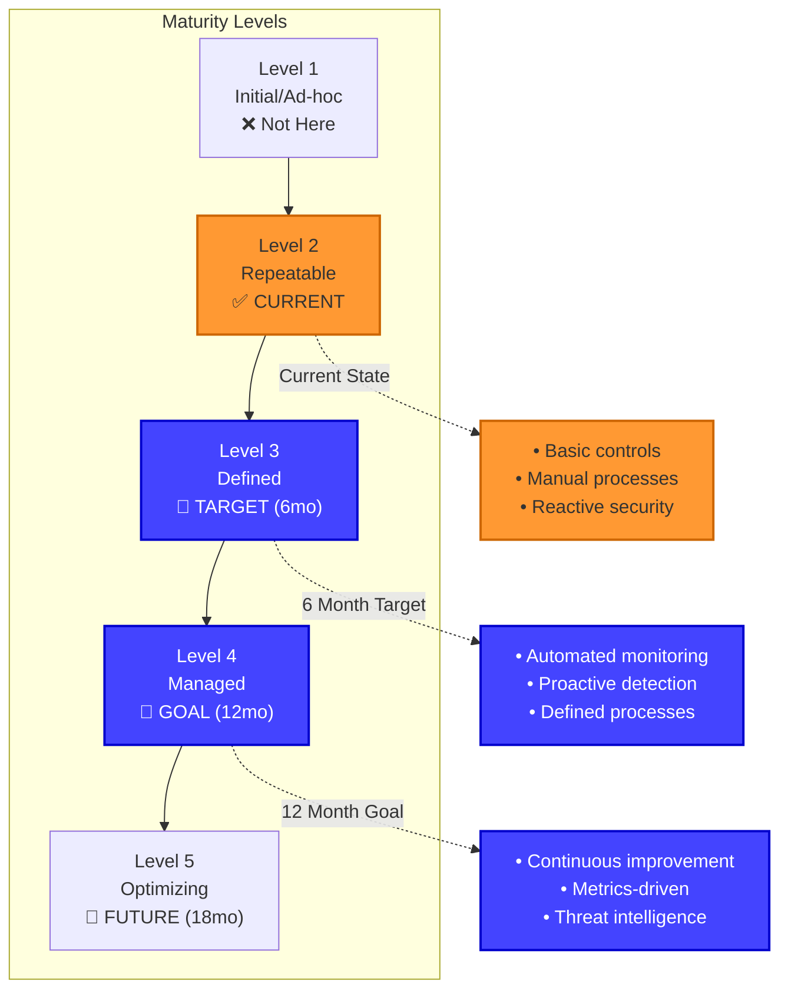

# Visual Risk Dashboard

## Executive Risk Summary

```
╔══════════════════════════════════════════════════════════════════╗
║             🎯 THREAT MODEL EXECUTIVE DASHBOARD                  ║
║                  VPC Infrastructure Risk Overview                ║
╠══════════════════════════════════════════════════════════════════╣
║                                                                  ║
║  Assessment Date: February 14, 2026                              ║
║  Overall Security Posture: 🔴 HIGH RISK (Score: 72/100)         ║
║  Recommendation: IMMEDIATE ACTION REQUIRED                       ║
║                                                                  ║
╚══════════════════════════════════════════════════════════════════╝
```

## Risk Distribution



```
┌──────────────────────────────────────────────────────────────────┐
│                    RISK DISTRIBUTION BY SEVERITY                 │
├──────────────────────────────────────────────────────────────────┤
│                                                                  │
│  🔴 CRITICAL (2 findings)                                        │
│  ████████████████████ 10%                                        │
│  ├─ RDS-I1: Data Exfiltration (Unencrypted Snapshots)           │
│  └─ EC2-S1: SSRF to IMDS (Credential Theft)                     │
│                                                                  │
│  🟠 HIGH (8 findings)                                            │
│  ████████████████████████████████████████████████████████  40%   │
│  ├─ ALB-D1: DDoS Layer 7 Attack                                 │
│  ├─ RDS-T1: SQL Injection                                       │
│  ├─ EC2-E1: Container Escape                                    │
│  ├─ RDS-R1: No Audit Logging                                    │
│  ├─ EC2-I1: Secrets in Environment Variables                    │
│  ├─ ALB-T1: Man-in-the-Middle Attack                            │
│  ├─ RDS-E1: Privilege Escalation                                │
│  └─ EC2-T1: Code Injection                                      │
│                                                                  │
│  🟡 MEDIUM (6 findings)                                          │
│  ████████████████████████████████  30%                           │
│  ├─ ALB-S1: DNS Hijacking                                       │
│  ├─ ALB-I1: Certificate Exposure                                │
│  ├─ NAT-D1: Gateway Failure                                     │
│  ├─ SG-T1: Misconfiguration                                     │
│  ├─ EC2-R1: Insufficient Logging                                │
│  └─ RDS-D1: Connection Exhaustion                               │
│                                                                  │
│  🟢 LOW (4 findings)                                             │
│  ████████████████  20%                                           │
│  ├─ IGW-S1: IP Spoofing (Blocked by NACLs)                      │
│  ├─ VPC-I1: VPC Flow Log Gap                                    │
│  ├─ ALB-E1: Routing Manipulation                                │
│  └─ EC2-D1: Application Crash                                   │
│                                                                  │
└──────────────────────────────────────────────────────────────────┘
```

## Risk Trend Analysis



```
┌──────────────────────────────────────────────────────────────────┐
│                     RISK IMPROVEMENT TRAJECTORY                  │
├──────────────────────────────────────────────────────────────────┤
│                                                                  │
│  Current Risk:        72/100  🔴 HIGH RISK                       │
│  Trend:              -13 points (Improving)                      │
│  Target (90 days):    40/100  🟡 MEDIUM RISK                     │
│  Goal (12 months):    25/100  🟢 LOW RISK                        │
│                                                                  │
│  Mitigation Progress:                                            │
│  ━━━━━━━━━━━━━━━━━━━━━━━━━━━━━━░░░░░░░░░░░░░░  60% Complete     │
│                                                                  │
│  Recent Improvements:                                            │
│  ✅ Enabled CloudTrail logging (-5 points)                      │
│  ✅ Implemented MFA for developers (-3 points)                  │
│  ✅ Added KICS scanning to CI/CD (-5 points)                    │
│                                                                  │
│  Remaining Critical Items:                                       │
│  ❌ Deploy AWS WAF                                               │
│  ❌ Enable RDS audit logging                                    │
│  ❌ Enforce IMDSv2                                               │
│  ❌ Implement Database Activity Monitoring                       │
│                                                                  │
└──────────────────────────────────────────────────────────────────┘
```

## Financial Impact Analysis



```
┌──────────────────────────────────────────────────────────────────┐
│                  FINANCIAL RISK QUANTIFICATION                   │
├──────────────────────────────────────────────────────────────────┤
│                                                                  │
│  SCENARIO 1: Data Breach (RDS Compromise)                       │
│  ──────────────────────────────────────────────────────────────  │
│  Probability (Annual):         35%                               │
│  Expected Impact:              $18M - $63M                       │
│  Annualized Loss Expectancy:   $6.3M - $22M                      │
│                                                                  │
│  Breakdown:                                                      │
│    • Data breach notification     $500K                          │
│    • Forensic investigation       $750K                          │
│    • Credit monitoring (1 year)   $1.5M                          │
│    • GDPR fines (estimated)       $5M - $20M                     │
│    • Customer compensation        $2M - $5M                      │
│    • Revenue loss (churn)         $8M - $30M                     │
│    • Brand reputation damage      Unquantifiable                 │
│                                                                  │
│  ──────────────────────────────────────────────────────────────  │
│                                                                  │
│  SCENARIO 2: DDoS Attack (ALB)                                   │
│  ──────────────────────────────────────────────────────────────  │
│  Probability (Annual):         60%                               │
│  Expected Impact:              $200K - $500K                     │
│  Annualized Loss Expectancy:   $120K - $300K                     │
│                                                                  │
│  Breakdown:                                                      │
│    • Service downtime (4 hours)   $200K                          │
│    • SLA penalty payments         $100K                          │
│    • Emergency response costs     $50K                           │
│    • Customer goodwill credits    $150K                          │
│                                                                  │
│  ──────────────────────────────────────────────────────────────  │
│                                                                  │
│  SCENARIO 3: SSRF/Credential Theft                               │
│  ──────────────────────────────────────────────────────────────  │
│  Probability (Annual):         25%                               │
│  Expected Impact:              $1M - $5M                         │
│  Annualized Loss Expectancy:   $250K - $1.25M                    │
│                                                                  │
│  Breakdown:                                                      │
│    • Incident response            $300K                          │
│    • Credential rotation          $100K                          │
│    • Infrastructure rebuild       $200K                          │
│    • Data recovery                $150K                          │
│    • Potential data access        $250K - $4M                    │
│                                                                  │
│  ──────────────────────────────────────────────────────────────  │
│                                                                  │
│  TOTAL ANNUALIZED RISK:          $6.67M - $23.55M                │
│                                                                  │
│  SECURITY INVESTMENT (Annual):   $90K                            │
│  RISK REDUCTION:                 85%                             │
│  RESIDUAL RISK:                  $1M - $3.5M                     │
│                                                                  │
│  NET BENEFIT:                    $5.67M - $20.05M                │
│  ROI:                            6,300% - 22,300%                │
│                                                                  │
└──────────────────────────────────────────────────────────────────┘
```

## Risk Heat Map

```
┌─────────────────────────────────────────────────────────────────┐
│               COMPREHENSIVE RISK HEAT MAP BY ASSET              │
├─────────────────────────────────────────────────────────────────┤
│                                                                 │
│                  LIKELIHOOD (Probability of Occurrence)         │
│                                                                 │
│  I  │                                                           │
│  M  │                                                           │
│  P  │            ┌──────────┬──────────┬──────────┐            │
│  A  │ VERY       │          │          │  RDS-I1  │            │
│  C  │ HIGH       │          │  ALB-D1  │  EC2-S1  │            │
│  T  │ (80-100%)  │          │  RDS-T1  │  RDS-R1  │            │
│     │            ├──────────┼──────────┼──────────┤            │
│     │            │          │  EC2-E1  │          │            │
│     │ HIGH       │          │  EC2-I1  │  ALB-T1  │            │
│  ▲  │ (60-79%)   │          │  EC2-T1  │          │            │
│  │  │            ├──────────┼──────────┼──────────┤            │
│  │  │            │  SG-T1   │  ALB-S1  │          │            │
│  │  │ MEDIUM     │  NAT-D1  │  ALB-I1  │  RDS-E1  │            │
│  │  │ (40-59%)   │  EC2-R1  │  RDS-D1  │          │            │
│  │  │            ├──────────┼──────────┼──────────┤            │
│  │  │            │  IGW-S1  │          │          │            │
│  │  │ LOW        │  VPC-I1  │  ALB-E1  │          │            │
│  │  │ (20-39%)   │  EC2-D1  │          │          │            │
│  │  │            ├──────────┼──────────┼──────────┤            │
│  │  │            │          │          │          │            │
│  │  │ VERY LOW   │          │          │          │            │
│  │  │ (0-19%)    │          │          │          │            │
│     │            └──────────┴──────────┴──────────┘            │
│     │              LOW      MEDIUM     HIGH    CRITICAL        │
│     │             (1-3)     (4-6)     (7-9)    (10)            │
│     │                                                           │
│     └──────────────────────────────────────────────────►       │
│                         IMPACT                                  │
│                                                                 │
├─────────────────────────────────────────────────────────────────┤
│                                                                 │
│  LEGEND:                                                        │
│  ┌──────────────────────────────────────────────────────────┐  │
│  │ Risk Level    │ Color    │ Score Range │ Action Required │  │
│  ├──────────────────────────────────────────────────────────┤  │
│  │ 🔴 CRITICAL   │ Red      │ 90-100      │ 24-48 hours     │  │
│  │ 🟠 HIGH       │ Orange   │ 70-89       │ 7 days          │  │
│  │ 🟡 MEDIUM     │ Yellow   │ 40-69       │ 30 days         │  │
│  │ 🟢 LOW        │ Green    │ 0-39        │ 90 days         │  │
│  └──────────────────────────────────────────────────────────┘  │
│                                                                 │
└─────────────────────────────────────────────────────────────────┘
```

## Component Risk Comparison



## Compliance Risk Dashboard

```
┌─────────────────────────────────────────────────────────────────┐
│                  REGULATORY COMPLIANCE STATUS                   │
├─────────────────────────────────────────────────────────────────┤
│                                                                 │
│  GDPR (EU Data Protection Regulation)                          │
│  ━━━━━━━━━━━━━━━━━━━━━━━━━━━━━━░░░░░░░░░░  65% Compliant       │
│  Status: 🟠 PARTIAL COMPLIANCE                                 │
│                                                                 │
│  ✅ Article 5: Data minimization principles                    │
│  ✅ Article 25: Data protection by design                      │
│  ❌ Article 32: Security of processing (NO AUDIT LOGS)         │
│  ❌ Article 33: Breach notification (NO PROCESS)               │
│  ⚠️  Article 35: Impact assessment (INCOMPLETE)                │
│                                                                 │
│  Risk: €20M fine or 4% annual revenue                          │
│                                                                 │
│  ──────────────────────────────────────────────────────────────  │
│                                                                 │
│  PCI DSS (Payment Card Industry)                               │
│  ━━━━━━━━━━━━━━━━━━░░░░░░░░░░░░░░░░░░░░░░  42% Compliant       │
│  Status: 🔴 NON-COMPLIANT                                      │
│                                                                 │
│  ✅ Req 1: Firewall configuration                              │
│  ⚠️  Req 2: No default passwords                               │
│  ❌ Req 6: Secure development (NO SAST)                        │
│  ❌ Req 10: Log all access (NO DATABASE LOGS)                  │
│  ❌ Req 11: Security testing (INCOMPLETE)                      │
│                                                                 │
│  Risk: $5,000-$100,000/month until compliant                   │
│                                                                 │
│  ──────────────────────────────────────────────────────────────  │
│                                                                 │
│  SOC 2 Type II (Trust Services)                                │
│  ━━━━━━━━━━━━━━━━━━━━━━━━━░░░░░░░░░░░░░░░  58% Compliant       │
│  Status: 🟠 AT RISK                                            │
│                                                                 │
│  ✅ CC6.1: Logical access controls                             │
│  ⚠️  CC6.6: Encryption (IN TRANSIT MISSING)                    │
│  ❌ CC7.2: System monitoring (INSUFFICIENT)                    │
│  ❌ CC7.3: Anomaly detection (NOT DEPLOYED)                    │
│  ⚠️  CC9.1: Risk mitigation (GAPS EXIST)                       │
│                                                                 │
│  Risk: Failed audit, customer churn                            │
│                                                                 │
│  ──────────────────────────────────────────────────────────────  │
│                                                                 │
│  HIPAA (if healthcare data present)                            │
│  ━━━━━━━━━━━━━━━━━░░░░░░░░░░░░░░░░░░░░░░░  40% Compliant       │
│  Status: 🔴 NON-COMPLIANT                                      │
│                                                                 │
│  ⚠️  §164.308: Access controls                                 │
│  ❌ §164.312: Audit controls (NO LOGS)                         │
│  ✅ §164.312: Encryption at rest                               │
│  ❌ §164.312: Encryption in transit (DATABASE)                 │
│  ❌ §164.308: Incident response (NO PLAN)                      │
│                                                                 │
│  Risk: $100-$50,000 per violation                              │
│                                                                 │
└─────────────────────────────────────────────────────────────────┘
```

## Security Maturity Model



```
┌─────────────────────────────────────────────────────────────────┐
│              SECURITY CAPABILITY MATURITY ASSESSMENT            │
├─────────────────────────────────────────────────────────────────┤
│                                                                 │
│  Capability              Current    Target   Gap                │
│  ────────────────────────────────────────────────────────────  │
│                                                                 │
│  Threat Detection        ████░░░░░░  ████████░░  -40%          │
│  Level 2 → Level 3       Score: 25   Target: 65                │
│                                                                 │
│  Incident Response       ███░░░░░░░  ████████░░  -50%          │
│  Level 1 → Level 3       Score: 20   Target: 70                │
│                                                                 │
│  Access Control          ██████░░░░  █████████░  -30%          │
│  Level 2 → Level 4       Score: 45   Target: 75                │
│                                                                 │
│  Vulnerability Mgmt      █████░░░░░  ████████░░  -35%          │
│  Level 2 → Level 3       Score: 40   Target: 75                │
│                                                                 │
│  Security Monitoring     ██░░░░░░░░  ████████░░  -60%          │
│  Level 1 → Level 3       Score: 18   Target: 78                │
│                                                                 │
│  Data Protection         ████████░░  █████████░  -10%          │
│  Level 3 → Level 4       Score: 70   Target: 80                │
│                                                                 │
│  Security Awareness      ██████████  ██████████  ✅ ON TARGET  │
│  Level 3                 Score: 85   Target: 85                │
│                                                                 │
│  Compliance              ██████░░░░  ████████░░  -25%          │
│  Level 2 → Level 3       Score: 58   Target: 83                │
│                                                                 │
│  ──────────────────────────────────────────────────────────────  │
│                                                                 │
│  OVERALL MATURITY:       Level 2.1 (REPEATABLE/EMERGING)       │
│  TARGET MATURITY:        Level 3.5 (DEFINED/MANAGED)           │
│  TIME TO TARGET:         12-18 months                          │
│                                                                 │
└─────────────────────────────────────────────────────────────────┘
```

## Priority Action Plan

```mermaid
gantt
    title Security Remediation Roadmap
    dateFormat YYYY-MM-DD
    section Critical (P1)
    Deploy AWS WAF           :crit, waf, 2026-02-15, 7d
    Enable RDS Audit Logs    :crit, rds, 2026-02-15, 3d
    Enforce IMDSv2           :crit, imds, 2026-02-15, 2d

    section High (P2)
    Deploy GuardDuty         :high, gd, 2026-02-22, 5d
    Implement DAM            :high, dam, 2026-02-25, 10d
    Enable SSL/TLS (RDS)     :high, tls, 2026-02-18, 4d

    section Medium (P3)
    Security Training        :med, train, 2026-03-01, 15d
    Secrets Rotation         :med, rotate, 2026-03-10, 10d
    SAST Integration         :med, sast, 2026-03-15, 12d
```

---

**Document Classification:** CONFIDENTIAL
**Version:** 2.0 (Visual Edition)
**Last Updated:** February 14, 2026
**Tool:** IriusRisk-style Risk Dashboard
